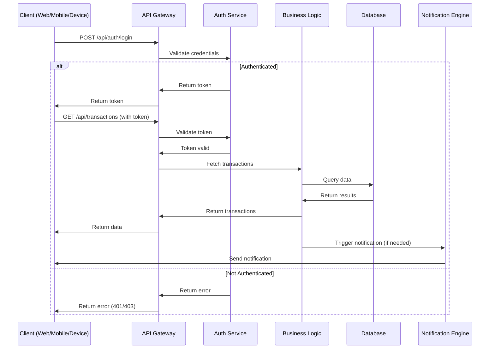

# API Design

## Overview

The SRT platform exposes a comprehensive set of RESTful and real-time APIs to support all business processes, integrations, and user interactions. The API layer is designed for security, scalability, and ease of integration with both internal and external systems.

## 1. API Structure

APIs are organized by functional domains:

- **Authentication:** User and device login, registration, and profile management
- **Transporter Management:** Company, vehicle, and driver operations
- **Vehicle & Plate Recognition:** ANPR, vehicle status, and history
- **Transaction Management:** Import/export workflows, status updates
- **Document Management:** Permits, delivery orders, and compliance
- **Notification:** Multi-channel alerts and delivery tracking
- **Analytics & Reporting:** Dashboards, KPIs, and export tools
- **Edge Device Management:** IoT device registration, status, and sync
- **Container Exchange:** Coordination between freight forwarders and transporters

### 1.1 API Structure Diagram

```mermaid
graph TD
    A[Authentication APIs] --> B[Login/Register]
    A --> C[Profile Management]
    D[Transporter APIs] --> E[Company Management]
    D --> F[Vehicle Management]
    G[Vehicle & Plate APIs] --> H[ANPR Detection]
    G --> I[Vehicle Status]
    G --> J[History]
    K[Transaction APIs] --> L[Import/Export]
    K --> M[Status Updates]
    N[Document APIs] --> O[Permits]
    N --> P[Delivery Orders]
    N --> Q[Compliance Docs]
    R[Notification APIs] --> S[SMS/WhatsApp/Email/Push]
    R --> T[Delivery Tracking]
    U[Analytics APIs] --> V[Dashboards]
    U --> W[KPIs]
    U --> X[Export Tools]
    Y[Edge Device APIs] --> Z[Device Registration]
    Y --> AA[Status/Sync]
    AB[Container Exchange APIs] --> AC[Initiate Exchange]
    AB --> AD[Accept/Complete]
    style A fill:#2196F3,stroke:#1565C0,stroke-width:2px,color:#fff
    style D fill:#4CAF50,stroke:#2E7D32,stroke-width:2px,color:#fff
    style G fill:#FF9800,stroke:#E65100,stroke-width:2px,color:#fff
    style K fill:#9C27B0,stroke:#4A148C,stroke-width:2px,color:#fff
    style N fill:#F44336,stroke:#B71C1C,stroke-width:2px,color:#fff
    style R fill:#795548,stroke:#3E2723,stroke-width:2px,color:#fff
    style U fill:#607D8B,stroke:#263238,stroke-width:2px,color:#fff
    style Y fill:#E91E63,stroke:#880E4F,stroke-width:2px,color:#fff
    style AB fill:#009688,stroke:#004D40,stroke-width:2px,color:#fff
```



## 2. API Endpoints

### 2.1 Core API Endpoints

#### 2.1.1 Authentication APIs
```
POST /api/auth/login
POST /api/auth/register
POST /api/auth/refresh
POST /api/auth/logout
GET /api/auth/profile
PUT /api/auth/profile
```

#### 2.1.2 Transporter Management APIs
```
GET /api/transporters
POST /api/transporters
GET /api/transporters/:id
PUT /api/transporters/:id
DELETE /api/transporters/:id
POST /api/transporters/:id/vehicles
GET /api/transporters/:id/vehicles
PUT /api/transporters/:id/vehicles/:vehicleId
DELETE /api/transporters/:id/vehicles/:vehicleId
```

#### 2.1.3 Vehicle and Plate Recognition APIs
```
POST /api/plates/detect
GET /api/plates/history
GET /api/plates/verify/:plateNumber
POST /api/plates/register
PUT /api/plates/:id/status
```

#### 2.1.4 Transaction Management APIs
```
POST /api/transactions
GET /api/transactions
GET /api/transactions/:id
PUT /api/transactions/:id/status
GET /api/transactions/export
POST /api/transactions/import
```

#### 2.1.5 Document Management APIs
```
POST /api/documents/tdo
GET /api/documents/tdo/:id
POST /api/documents/edn
GET /api/documents/edn/:id
POST /api/documents/ep
GET /api/documents/ep/:id
POST /api/documents/tcp
GET /api/documents/tcp/:id
```

#### 2.1.6 Notification APIs
```
POST /api/notifications/send
GET /api/notifications/history
POST /api/notifications/sms
POST /api/notifications/whatsapp
POST /api/notifications/email
POST /api/notifications/push
```

#### 2.1.7 Real-time WebSocket Events
```
ws://api/live/plate-detections
ws://api/live/transaction-updates
ws://api/live/notifications
ws://api/live/dashboard-updates
```

#### 2.1.8 Analytics and Reporting APIs
```
GET /api/analytics/dashboard
GET /api/analytics/transactions
GET /api/analytics/performance
GET /api/analytics/reports
POST /api/analytics/export
```

#### 2.1.9 IoT Edge Device APIs
```
POST /api/edge/register
GET /api/edge/status
PUT /api/edge/config
POST /api/edge/sync
GET /api/edge/logs
```

#### 2.1.10 Container Exchange APIs
```
POST /api/container-exchange/initiate
GET /api/container-exchange/available
PUT /api/container-exchange/:id/accept
PUT /api/container-exchange/:id/complete
GET /api/container-exchange/history
```

#### 2.1.11 Stakeholder-Specific APIs

**Freight Forwarder APIs:**
```
POST /api/freight-forwarders/register
GET /api/freight-forwarders/transactions
POST /api/freight-forwarders/containers/delivery
PUT /api/freight-forwarders/containers/:id/status
GET /api/freight-forwarders/billing
```

**Shipper APIs:**
```
POST /api/shippers/register
GET /api/shippers/cargo-tracking
POST /api/shippers/departure-confirm
POST /api/shippers/receipt-confirm
GET /api/shippers/transactions
```

**Port Terminal APIs:**
```
POST /api/terminals/register
GET /api/terminals/containers
POST /api/terminals/delivery-confirm
PUT /api/terminals/booking/:id/status
GET /api/terminals/operations
```

**Transit Park APIs:**
```
POST /api/transit-parks/register
GET /api/transit-parks/slots/availability
POST /api/transit-parks/trucks/arrival
POST /api/transit-parks/trucks/departure
GET /api/transit-parks/occupancy
```

**Security Agency APIs:**
```
POST /api/security/access-control
GET /api/security/transactions/verify
GET /api/security/alerts
POST /api/security/incident-report
GET /api/security/compliance-status
```

## 3. API Interaction Flow

This diagram illustrates a typical API interaction, from authentication to data retrieval and notification:



## 4. Key API Features

- **RESTful & WebSocket Endpoints:** For synchronous and real-time operations
- **Secure Authentication:** JWT tokens, refresh tokens, and role-based access
- **Comprehensive Coverage:** All business domains and workflows
- **Extensible:** Designed for easy integration with third-party and port authority systems
- **Consistent Versioning:** Backward-compatible API evolution
- **Detailed Documentation:** OpenAPI/Swagger for developer onboarding

---

**Document Version:** 1.0  
**Last Updated:** July 2025