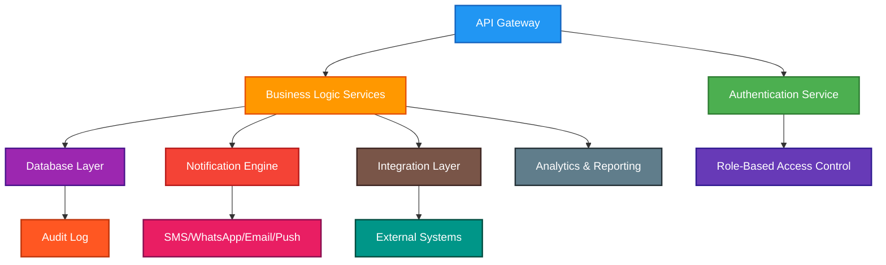
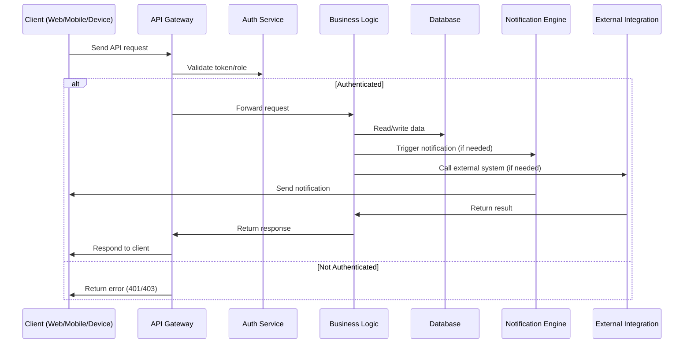

# Backend Design

## Overview

The SORAT backend is engineered for reliability, scalability, and security. It orchestrates all business logic, data management, integrations, and real-time communications for the port management platform. The backend is modular, API-driven, and supports both cloud and on-premise deployments.

## 1. Backend Service Architecture

The backend is composed of several core services and components:
- **API Gateway:** Central entry point for all client and device requests
- **Authentication & Authorization:** Role-based access control for all users and devices
- **Business Logic Services:** Handles scheduling, transaction management, and workflow automation
- **Database Layer:** Stores all operational, transactional, and audit data
- **Notification Engine:** Manages SMS, WhatsApp, email, and push notifications
- **Integration Layer:** Connects with external systems (e.g., barrier gates, weight sensors, port authority APIs)
- **Analytics & Reporting:** Aggregates and analyzes operational data for dashboards and KPIs

### 1.1 Backend Component Architecture Diagram

## 2. Backend Workflow: API Request Lifecycle

This diagram illustrates how a typical API request is processed by the backend, from authentication to business logic execution and notification.

## 3. Security and Compliance

### 3.1 Security Framework
- **Data Encryption:** End-to-end encryption for all sensitive data
- **Access Control:** Role-based permissions for different stakeholder types
- **Audit Logging:** Comprehensive logging of all system activities
- **Secure Communication:** TLS encryption for all API communications
- **Local Security:** AES encryption for edge device data storage

### 3.2 Compliance Requirements
- **Port Authority Regulations:** Adherence to local port management guidelines
- **Data Protection:** Compliance with applicable data privacy laws
- **Security Protocols:** Integration with existing port security systems
- **Operational Standards:** Alignment with international port management standards

## 4. Key Backend Features

- **RESTful & WebSocket APIs:** For real-time and batch operations
- **Role-Based Security:** Fine-grained access for all user types
- **Scalable Data Storage:** PostgreSQL, Redis, and cloud storage
- **Audit Logging:** Full traceability of all actions and changes
- **Notification Management:** Multi-channel, automated, and event-driven
- **Integration Ready:** Modular connectors for third-party and port authority systems
- **Analytics & Reporting:** Real-time and historical data for dashboards and compliance

---

**Document Version:** 1.0  
**Last Updated:** July 2025