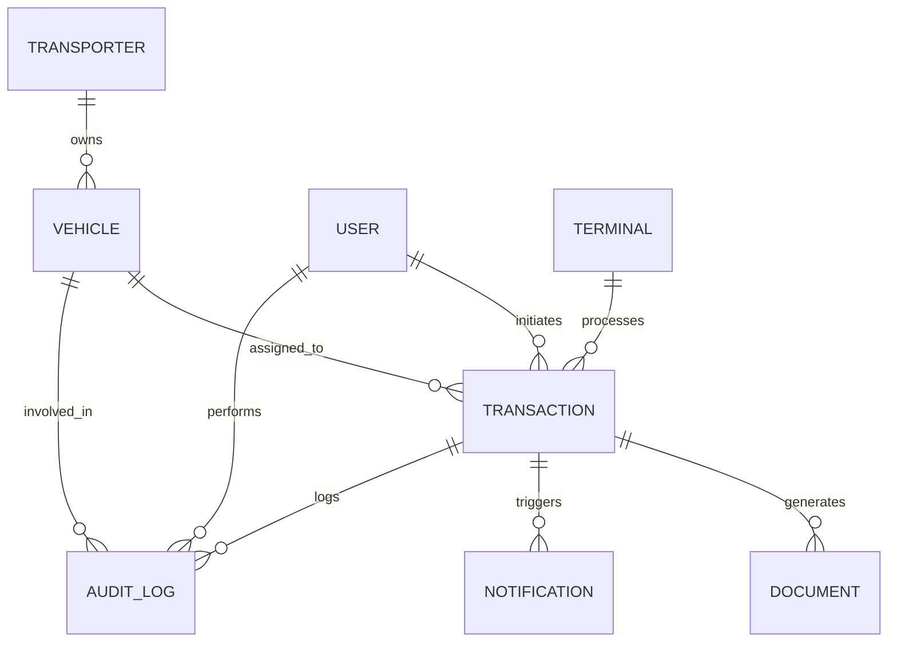
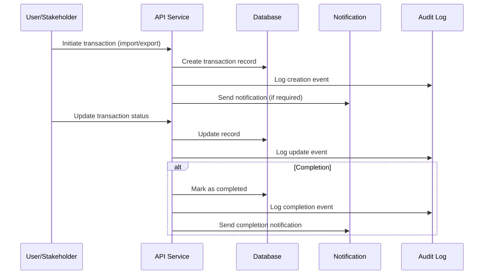

# Database Design

## Overview

The SORAT platform uses a robust, scalable, and secure database architecture to manage all operational, transactional, and audit data. The design supports real-time operations, historical analytics, and regulatory compliance, while ensuring data integrity and high availability.

## 1. Entity-Relationship Model

The core database entities include:
- **Transporter:** Company and vehicle registration
- **Vehicle:** Plate number, type, and operational status
- **Transaction:** Import/export operations, status, and timestamps
- **Document:** Permits, delivery orders, and compliance records
- **Notification:** Multi-channel alerts and delivery status
- **User/Stakeholder:** Role-based access and activity logs
- **Terminal:** Port terminal operations and queue management
- **Audit Log:** Full traceability of all changes and actions

### 1.1 Entity-Relationship Diagram

## 2. Data Lifecycle: Transaction Record

This diagram illustrates the lifecycle of a transaction record, from creation to completion and audit:

## 3. Key Database Features

- **Relational Model:** PostgreSQL for structured, transactional data
- **Real-Time Sync:** Support for Firebase/Redis for live updates
- **Audit Logging:** Immutable records for compliance and traceability
- **Role-Based Access:** Secure, permissioned data access
- **Scalability:** Partitioning and indexing for high performance
- **Backup & Recovery:** Automated, regular backups and disaster recovery

### 4. Data Model Details

#### 4.1 Transporter Entity
- Company name, registration number, contact details, vehicles, status, timestamps

#### 4.2 Vehicle Entity
- Plate number, type, model, insurance, driver details, status, timestamps

#### 4.3 Transaction Entity
- Transaction number, type, vehicle, container details, status, stakeholders, documents, timestamps

#### 4.4 Document Entity
- Type (TDO, EDN, EP, TCP), document number, transaction, issued by/to, validity, status, file URL, timestamps

#### 4.5 Notification Entity
- Type (sms, whatsapp, email, push), recipient, message, transaction, status, timestamps

#### 4.6 Audit Log
- All changes and actions, user, entity, timestamp, event type

---

**Document Version:** 1.0  
**Last Updated:** July 2025