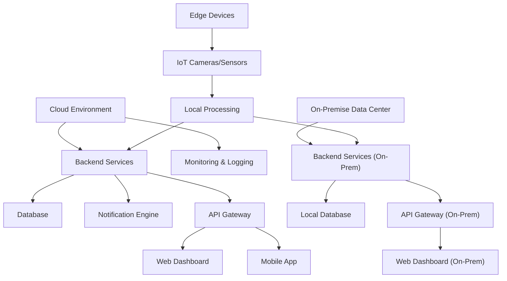
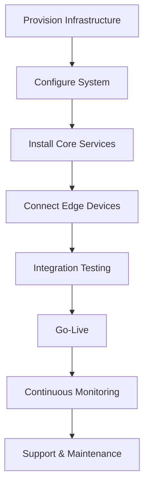

# Deployment

## Overview

SRT supports flexible deployment options to meet the needs of modern port operations, including cloud, on-premise, and hybrid models. The deployment process is designed for reliability, scalability, and security, ensuring minimal downtime and rapid go-live.

## 1. Deployment Topology

The system can be deployed in various configurations:
- **Cloud Deployment:** All backend services and databases are hosted in a secure cloud environment.
- **On-Premise Deployment:** Core services are installed within the port’s own data center for maximum control and compliance.
- **Hybrid Deployment:** Combines cloud and on-premise components, with edge devices operating at port entry/exit points.
- **Edge Devices:** IoT hardware and cameras are installed at strategic locations for real-time data capture and local processing.

### 1.1 Deployment Topology Diagram

## 2. Deployment Workflow

The deployment process follows a structured workflow to ensure a smooth rollout:
- **Provisioning:** Infrastructure and resources are provisioned in the target environment.
- **Configuration:** System components are configured for the specific deployment model.
- **Installation:** Core services, databases, and edge devices are installed and connected.
- **Testing:** End-to-end testing of all components and integrations.
- **Go-Live:** System is launched for production use.
- **Monitoring:** Continuous monitoring and support post-launch.

### 2.1 Deployment Workflow Diagram

## 3. Implementation Strategy

The SRT deployment follows a phased approach:

### 3.1 Phase 1: Foundation (Months 1-3)
- **Backend Development:** Core API services and database setup
- **Authentication System:** Role-based access control implementation
- **Basic Mobile App:** Essential functionality for transporters
- **IoT Edge Setup:** Hardware deployment and basic ANPR integration

### 3.2 Phase 2: Core Features (Months 4-6)
- **Full Stakeholder Integration:** Complete platform for all user types
- **Advanced Notifications:** Multi-channel communication system
- **Web Dashboard:** Comprehensive admin interface
- **Container Exchange System:** Freight forwarder/transporter coordination

### 3.3 Phase 3: Advanced Features (Months 7-9)
- **Analytics Dashboard:** Performance monitoring and reporting
- **Advanced Security:** Enhanced encryption and access controls
- **Integration APIs:** Third-party system connectivity
- **Mobile App Enhancement:** Advanced features and offline capabilities

### 3.4 Phase 4: Optimization (Months 10-12)
- **Performance Tuning:** System optimization and scaling
- **Advanced Analytics:** AI-powered insights and reporting
- **Optional Add-ons:** QR codes, barrier gates, weight sensors
- **User Training:** Comprehensive stakeholder onboarding

## 4. Key Deployment Features

- **Flexible Topology:** Cloud, on-premise, and hybrid support
- **Edge Integration:** Real-time data capture and processing at the port
- **Automated Provisioning:** Infrastructure as Code for repeatable deployments
- **Zero Downtime:** Blue/green and rolling deployment strategies
- **Comprehensive Testing:** Automated and manual validation before go-live
- **Continuous Monitoring:** Proactive support and rapid incident response

---

**Document Version:** 1.0  
**Last Updated:** July 2025