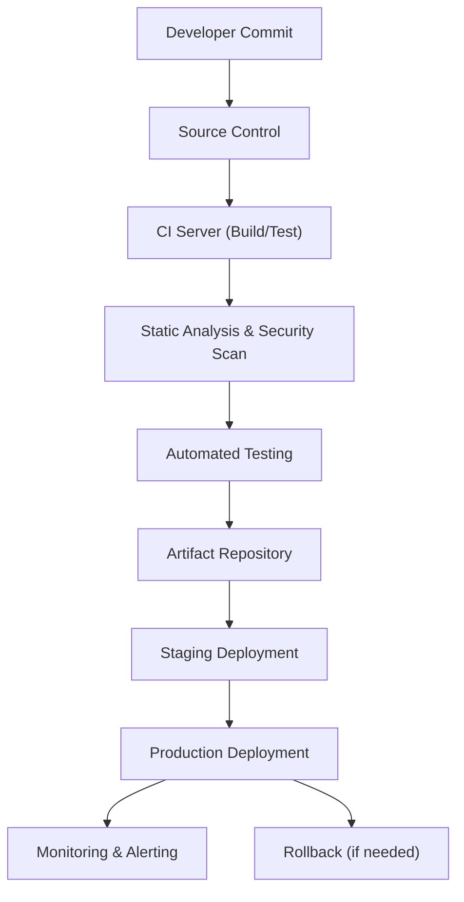
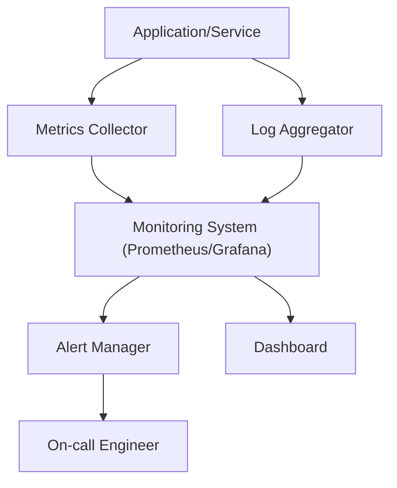

# DevOps

## Overview

SORAT employs modern DevOps practices to ensure rapid, reliable, and secure delivery of software updates, infrastructure management, and operational monitoring. The DevOps approach enables continuous improvement, high system availability, and fast response to operational issues.

## 1. CI/CD Pipeline

The Continuous Integration and Continuous Deployment (CI/CD) pipeline automates the process from code commit to production deployment:

- **Source Control:** All code is managed in a version-controlled repository (e.g., GitHub, GitLab)
- **Automated Build:** Code is automatically built and tested on every commit
- **Static Analysis & Security Scans:** Automated checks for code quality and vulnerabilities
- **Automated Testing:** Unit, integration, and end-to-end tests
- **Artifact Management:** Build artifacts are stored for traceability
- **Deployment:** Automated deployment to staging and production environments
- **Rollback:** Rapid rollback in case of failure

### 1.1 CI/CD Pipeline Diagram

## 2. Infrastructure Monitoring & Alerting

SORAT uses automated monitoring and alerting to ensure system health and rapid incident response:

- **Metrics Collection:** System, application, and network metrics are continuously collected
- **Log Aggregation:** Centralized logging for all services
- **Alerting:** Automated alerts for anomalies, failures, or security events
- **Dashboarding:** Real-time dashboards for operational visibility
- **Incident Response:** Defined playbooks for rapid resolution

### 2.1 Monitoring & Alerting Flow Diagram

## 3. Key DevOps Features

- **Automated CI/CD:** Rapid, reliable, and repeatable deployments
- **Infrastructure as Code:** Declarative management of cloud/on-prem resources
- **Comprehensive Monitoring:** Real-time metrics, logs, and dashboards
- **Proactive Alerting:** Automated detection and notification of issues
- **Disaster Recovery:** Backup, restore, and failover strategies
- **Security Integration:** Continuous security scanning and compliance checks

---

**Document Version:** 1.0  
**Last Updated:** July 2025
