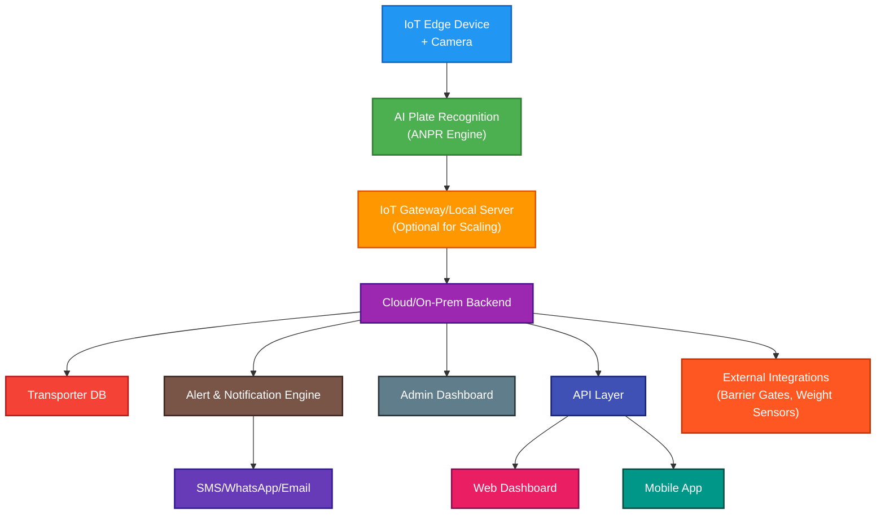

# System Architecture

## Overview

SRT is built on a robust, modular architecture that combines IoT edge devices, AI-powered recognition, secure cloud/on-premise backend services, and real-time dashboards. The system is designed for scalability, security, and seamless integration with port operations.

## 1. High-Level System Architecture

The architecture consists of several key layers and components:

- **IoT Edge Layer:** Devices and cameras at entry/exit points for real-time data capture and local processing.
    - IoT Edge Device: Jetson Nano, Raspberry Pi 4, or industrial camera system
    - HD IR Camera with night vision support
    - Local storage: SSD or SD card for offline logging
    - Power system: Solar + Battery backup for remote locations
    - AI Plate Detection: OpenALPR/YOLOv5 ANPR/OpenCV + Tesseract
    - Real-time video processing and plate extraction
    - Local caching and offline mode support
    - Edge ML model updates over-the-air
- **Backend Services:**
    - API Layer: Node.js, Python Flask, or FastAPI
    - Database: PostgreSQL for transporter/plate registry, Firebase for real-time updates
    - Authentication: Role-based access control for different stakeholder types
    - Data Encryption: TLS + Local AES encryption for plate logs
    - Notification Engine: Twilio, Firebase Cloud Messaging, WhatsApp Business API
- **Client Applications:**
    - Mobile Application: Cross-platform app for transporters and field operators
    - Web Dashboard: ReactJS/VueJS admin interface for monitoring and management
    - WhatsApp Integration: Business API for instant notifications
    - SMS/Email Notifications: Multi-channel communication system
- **External Integrations:** Optional modules for barrier gates, weight sensors, and third-party systems.

### 1.1 System Architecture Diagram

## 2. System Workflow

### 2.1 Vehicle Detection and Processing
1. **Detection:** Camera detects vehicle entering gate area
2. **Recognition:** Edge device processes video and extracts plate number using ANPR
3. **Verification:** Plate number cross-checked with transporter database
4. **Logging:** Transaction logged with timestamp, location, and status
5. **Notification:** Real-time alerts sent to relevant stakeholders
6. **Dashboard Update:** Admin dashboard reflects live status changes

### 2.2 Transaction Management
- **Unique Transaction IDs:** Sequential numbering with import/export prefixes
- **Status Tracking:** Real-time status updates throughout the cargo journey
- **Documentation Management:** Digital handling of TDO, EDN, EP, and other permits
- **Billing Integration:** Automated transaction-based charging system

## 3. Security & Scalability

- **Data Encryption:** TLS and AES for all sensitive data and logs
- **Role-Based Access Control:** Granular permissions for all user types
- **Edge ML Updates:** Over-the-air model updates for ANPR
- **Offline Mode:** Local caching and sync for remote/low-connectivity sites

## 4. Optional Add-ons & Integrations

- **QR-code authorization for vehicles and personnel**
- **Barrier gate and weight sensor integration**
- **API hooks for third-party logistics and port systems**

---

**Document Version:** 1.0  
**Last Updated:** July 2025